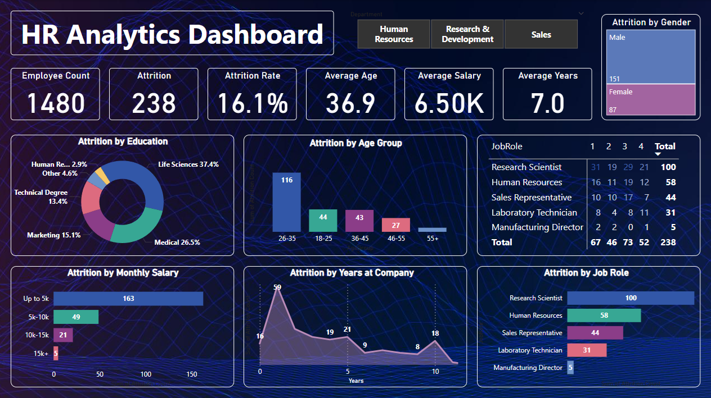
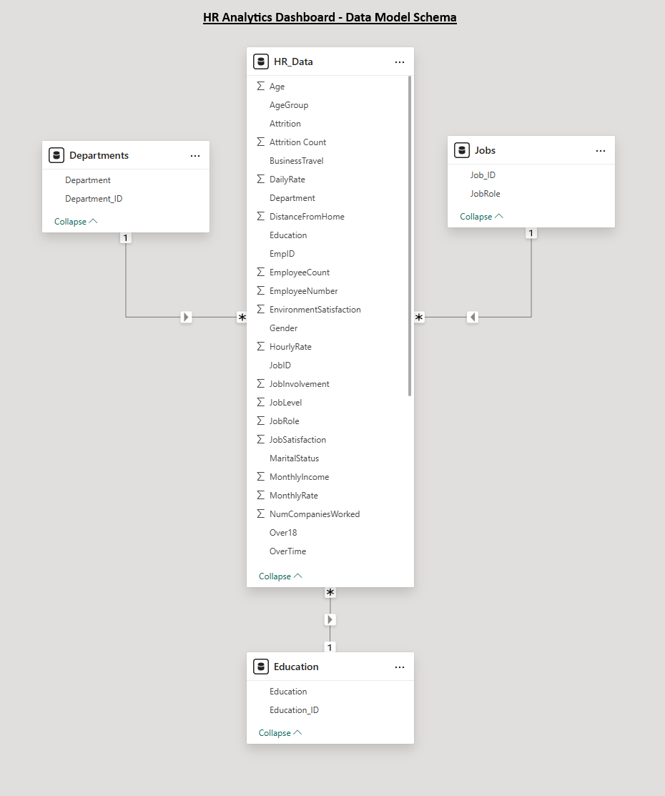

# Power BI Project: HR Analytics Dashboard

#### by Alex Melino

#

### Background and Dataset Information

This repo contains a Power BI project aimed at showcasing visualization and analytical skills. The dataset, located in the main directory of this repo as "HR_Data.xlsx", is a real-life dataset from an HR department of an anonymous company. The data centers around the rate of attrition for the company and various other information for a total of 38 columns and 1480 rows of data.

The goal was to create an interactive dashboard using Power BI that related the levels of attrition within the company to other factors such as job role, salary, years with the company, age, and gender. This dashboard gives insight to the HR department as to which employees may be most negatively affected. This project has a data cleaning phase where DAX (Data Analysis Expressions) are used, and a dashboard/visualization building phase where the data was used to craft the final product. This final dashboard is in the main directory of this repo as "dashboard.pbix".

The dataset consists of four tables, "Departments", "Education", "HR_Data", and "Jobs". The schema for this dataset has the "HR_Data" as the fact table and the other three tables as dimension (dim) tables. The following is a visual representation of the data model schema:

#

### Data Cleaning with DAX

The dataset was cleaned using the built-in Power BI tools and DAX. The first steps were to standardize the data, particularly a few columns that had certain inconsistencies. The "Gender" and "Business Travel" columns had incorrect values that were replaced using the built-in transformation tools (particularly the 'Replace Values' tool) present in Power BI. Additionally, many of the numerical columns were in text/numeric format with many values being "null" or "none". These were all changed to numeric-only columns and the values in question set to zero so as to be more useful for data analysis. 

Some data analysis expressions (DAX) were also used to create a a new column and also a measure which would then both be used to create some of the visualizations ahead. The conditional column created was labelled as "Attrition Count" which took a "yes/no" type column and made a new one with a 1 or a 0 instead. The sum of this column provides a count of the attrition within the company. The measure created is labelled as "Attrition Rate" which uses two columns to calculate the percentage of attrition within the company. The DAX for this measure is as follows:

- Attrition Rate = SUM(HR_Data[Attrition Count]) / SUM(HR_Data[EmployeeCount])

#

### Visualizations and Data Analysis

The dashboard was arranged with a variety of "cards" displaying simple information as well as interactive graphs and charts that allow the user to easily see trends within the company regarding attrition. A screenshot of the final dashboard product can be seen below:

The dashboard also features slicers (top right of the image) which allow the user to drill down on the data and see various trends by both department and by gender. 

#
